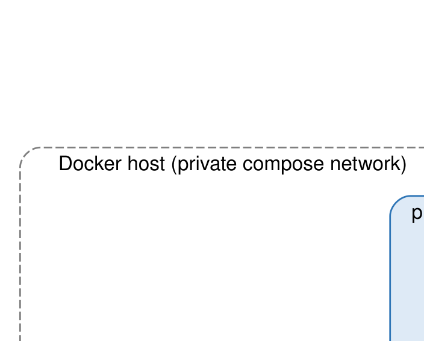

# Overview

The deployment is three containers on a private compose network. Only the proxy publishes ports to the host. It is set up for Magic Lantern Workbench (MLW) production: on first start the app creates an MLW project from the `mlw` plugin of the TACTIC `magiclantern` branch, alongside TACTIC's own system database.

| Component | Image | Role |
|-----------|-------|------|
| **proxy** | `nginx:stable-alpine` | Terminates TLS, serves static files and media, balances requests across the TACTIC workers |
| **tactic** | `python:3.11-slim` (built here) | Runs TACTIC's `monitor.py`, which supervises three CherryPy worker processes, and does the first-start setup |
| **db** | `postgres:16` | Stores two databases: `sthpw` (the TACTIC system database) and `mlw` (the MLW project) |

## Documents

The full reference documents are Word files in the repository:

- [Architecture](https://github.com/magic-lantern-workbench/mlw-TACTIC-docker/blob/mlw-integration/doc/mlw-TACTIC-docker_Architecture.docx)
- [sthpw schema](https://github.com/magic-lantern-workbench/mlw-TACTIC-docker/blob/mlw-integration/doc/mlw-TACTIC-docker_sthpw_Schema.docx)
- [MLW project schema](https://github.com/magic-lantern-workbench/mlw-TACTIC-docker/blob/mlw-integration/doc/mlw-TACTIC-docker_mlw_Schema.docx)
